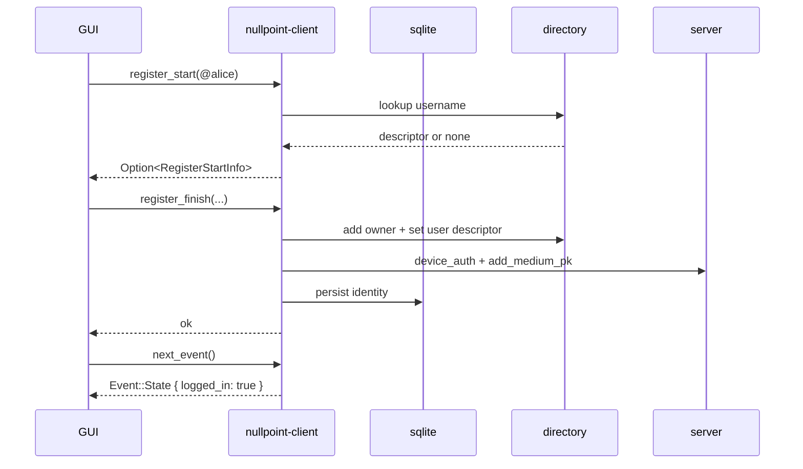
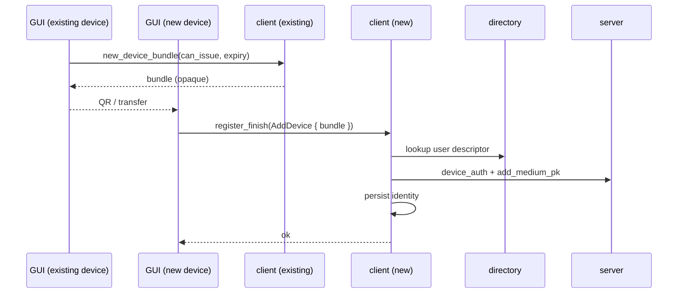
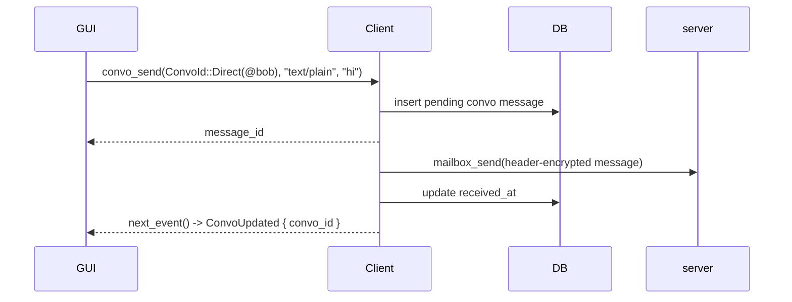

# nullpoint-client

`nullpoint-client` is a TDLib-like local service for Nullpoint. It owns identity, storage,
encryption, and networking so that UIs never need to speak crypto or server APIs
directly. The UI only uses a small JSON-RPC surface and renders events.

## What the GUI talks to

The GUI calls the internal JSON-RPC methods on a local `Client` instance:

- `register_start(username) -> Option<RegisterStartInfo>`
- `register_finish(RegisterFinish) -> Result<()>`
- `new_device_bundle(can_issue, expiry) -> NewDeviceBundle`
- `convo_list() -> [ConvoSummary]`
- `convo_history(convo_id, before, after, limit) -> [ConvoMessage]`
- `convo_send(convo_id, mime, body) -> message_id`
- `convo_create_group(server) -> ConvoId`
- `group_invite(group, username) -> Result<()>`
- `group_members(group) -> [GroupMember]`
- `group_accept_invite(dm_id) -> GroupId`
- `own_server() -> ServerName`
- `next_event() -> Event` (infallible, long-polling)

`next_event()` is the only push-style API. It blocks until the next event arrives.
Events are emitted only by the internal event loop in response to DB changes.

## High-level architecture

The client is a single process with structured concurrency:

- An RPC loop serving GUI requests.
- An event loop that watches the DB and emits `Event::State` + `Event::ConvoUpdated` + `Event::GroupUpdated`.
- A worker loop that starts send/recv + key rotation after login.

All three loops are raced together, and they all share the same `AnyCtx`.

## Login + registration flow

There are only two states: logged out and logged in. On startup, the client checks
`client_identity`:

- If present, it starts the worker loop and emits `Event::State { logged_in: true }`.
- If absent, it emits `Event::State { logged_in: false }`.

### Register a new username

1. GUI picks a username and server name.
2. GUI calls `register_finish(RegisterFinish::BootstrapNewUser { .. })`.
3. Client creates device identity, registers the username in the directory, and
   registers the device on the server.
4. Client persists identity and emits `Event::State { logged_in: true }`.

### Add a new device

1. An existing, logged-in device calls `new_device_bundle(can_issue, expiry)` and
   renders the opaque bundle (e.g., QR).
2. The new device calls `register_finish(RegisterFinish::AddDevice { bundle })`.
3. Client registers the device on the server, stores identity, and emits
   `Event::State { logged_in: true }`.

The bundle is opaque to the UI. Crypto is handled internally.

## Convo flow

Direct messages and group messages share a unified convo API:

- `convo_send(convo_id, mime, body)` inserts into `convo_messages` with `received_at = NULL`.
- The send loops look for pending rows (`received_at = NULL`, `send_error IS NULL`) and send encrypted payloads.
- On send failures, the client records `send_error` and sets a synthetic `received_at` to stop retries.
- The recv loops long-poll mailboxes, decrypt, verify, and insert new rows.
- The event loop emits `Event::ConvoUpdated { convo_id }` for new rows.

## Key rotation (internal)

Medium-term keys rotate automatically every hour. The previous key is retained so
late messages can be decrypted. These keys are never exposed to the UI.

## Data model (sqlite)

- `client_identity`: one row holding identity + key material (including cached server name).
- `convos`: conversation registry (direct + group), allows empty convos.
- `convo_messages`: plaintext history for both direct and group conversations, with optional `send_error`.
- `groups`: group descriptors + keys + tokens.
- `group_members`: roster entries (for crypto and membership enforcement).
- `mailbox_state`: mailbox cursor for long-polling.

## Event semantics

Events are derived from the DB:

- `Event::State { logged_in }` whenever identity appears/disappears.
- `Event::ConvoUpdated { convo_id }` whenever new convo rows appear.
- `Event::GroupUpdated { group }` whenever roster state changes.

No other component emits events directly; all producers simply update the DB and
call `DbNotify::touch()`.

## Notes for UI authors

- Treat the client as a local service. All heavy lifting is internal.
- `next_event()` is the main driver; call it in a long-polling loop.
- For message display, call `convo_history(convo_id, before, after, limit)` with
  `before = None` to load latest messages, then page backward by `before = id`.
